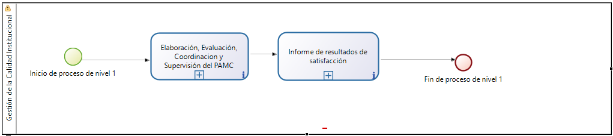
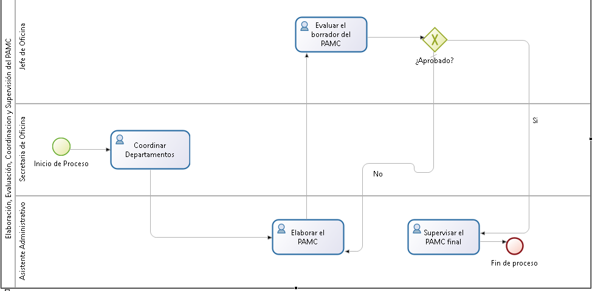
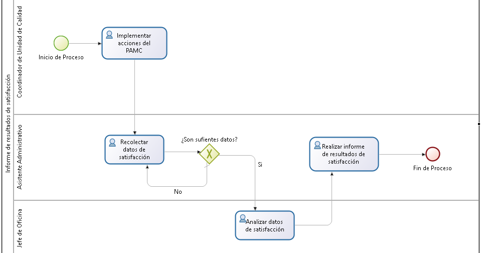
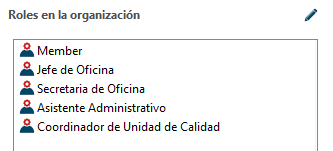
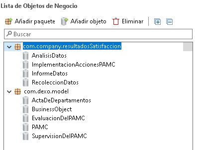
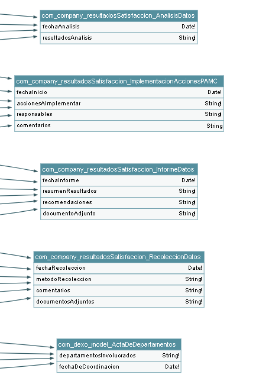
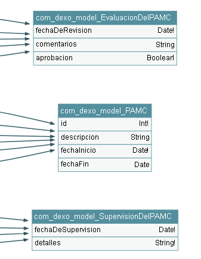
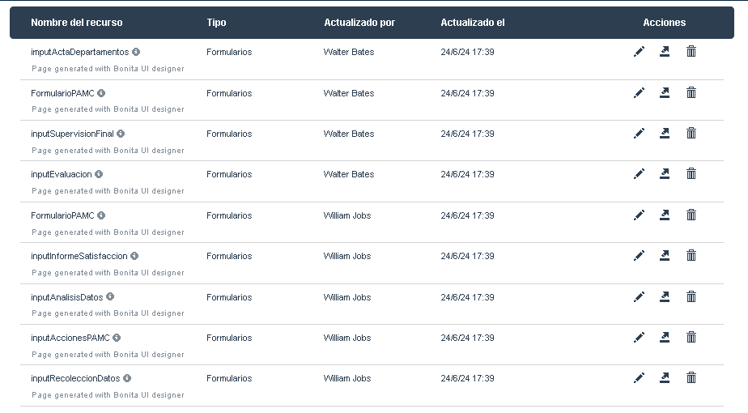
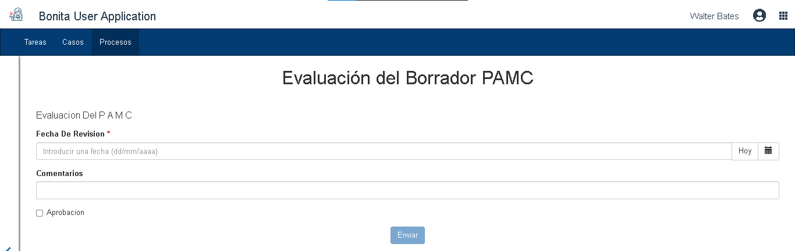

# 3.5 PROCESO DE GESTIÓN DE CALIDAD INSTITUCIONAL 

## Modelo

  

  

  

### Descripción:

#### Pool 1: Elaboración, Evaluación, Coordinación y Supervisión del PAMC

| **Descripción** | Este proceso abarca la elaboración, evaluación, coordinación y supervisión del Plan Anual de Mejora Continua (PAMC). Se inicia con la revisión de documentos clave, seguido por la elaboración del plan, coordinación con los departamentos correspondientes, evaluación del borrador del plan y finalización mediante supervisión y aprobación. Las actividades se realizan tanto en serie como en paralelo para optimizar el flujo de trabajo. |
|-----------------|-----------------------------------------------------------------------------------------------------------------------------------------------------------------------------------------------------------------------------------------------------------------------------------------------------------------------------------------------------------------------------------------------------------------------------------------------------------------------------------------------------------------------------------------------------------------------------------------------------------------------------------|
| **Entradas**    | - Plan de Gestión de la Calidad Institucional - PEI (Proyecto Educativo Institucional)                                                                                                                                                                                                                                                                                                                                                                                                                                                                                                                                                                                                         |
| **Salidas**     | - Plan Anual de Mejora Continua (PAMC)                                                                                                                                                                                                                                                                                                                                                                                                                                                                                                                                                                                                                                                                                                                        |
| **Tareas**      | - **Revisión de documentos**: El Coordinador de Calidad revisa los documentos iniciales. - **Elaboración del PAMC**: El Equipo de Evaluación elabora el borrador del PAMC. - **Coordinación con departamentos**: Los Administrativos coordinan con los diferentes departamentos involucrados. - **Evaluación del borrador del PAMC**: El Equipo de Evaluación revisa y evalúa el borrador del PAMC. - **Supervisión final del PAMC**: El Coordinador de Calidad supervisa y aprueba el PAMC finalizado. |

#### Pool 2: Informe de Resultado de Satisfacción

| **Descripción** | Este proceso se enfoca en la implementación de acciones para asegurar la calidad universitaria y medir la satisfacción de los estudiantes y otros interesados. Comienza con la implementación de las acciones planificadas, seguida por la recolección y análisis de datos de satisfacción, y culmina con la elaboración de un informe de resultados. En este caso, las tareas solo se llevaron a cabo en serie. |
|-----------------|--------------------------------------------------------------------------------------------------------------------------------------------------------------------------------------------------------------------------------------------------------------------------------------------------------------------------------------------------------------------------------------------------------------------------------------------------------------------------------------------------------------------------------------------------------------------------------------------------------------------------------------|
| **Entradas**    | - Plan Anual de Mejora Continua (PAMC)                                                                                                                                                                                                                                                                                                                                                                                                                                                                                                                                                                                                                                                                                                                        |
| **Salidas**     | - Medición de la Satisfacción                                                                                                                                                                                                                                                                                                                                                                                                                                                                                                                                                                                                                                                                                                                                                                                                 |
| **Tareas**      | - **Implementación de acciones del PAMC**: El Coordinador de Calidad implementa las acciones planificadas en el PAMC. - **Recolección de datos de satisfacción**: Los Administrativos recogen datos sobre la satisfacción de los estudiantes y otros interesados. - **Análisis de datos de satisfacción**: El Equipo de Evaluación analiza los datos recolectados. - **Informe de resultados de satisfacción**: El Coordinador de Calidad elabora y presenta un informe con los resultados de la satisfacción. |

### Sectores/departamentos/áreas-funcionales/papeles/roles involucrados en el proceso de negocio

| **Rol/Departamento**                                 |
|-----------------------------------------------------|
| - Plan de Gestión de la Calidad Institucional      |
| - PEI (Proyecto Educativo Institucional)            |

### Elementos de información necesarios (dato o información) en el proceso de negocio

| **Elementos de Información**       |
|-----------------------------------|
| - Plan Anual de Mejora Continua (PAMC) |
| - Medición de la Satisfacción       |

### Roles

  

### Modelo de Datos

  

  
  

### Formularios

  

### Ejemplo de Formulario

  

