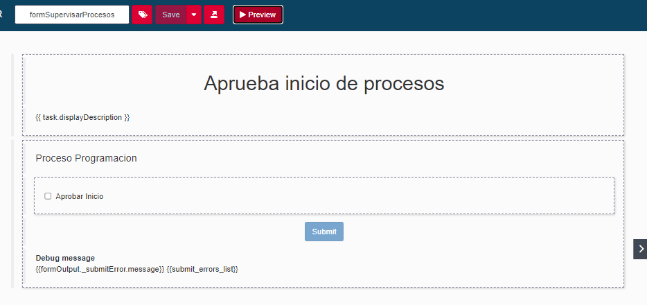
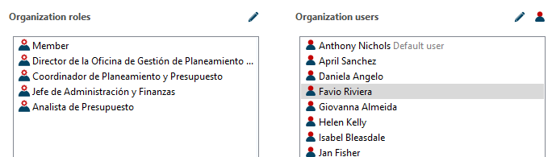

# 3.2 PROCESO DE GESTIÓN PRESUPUESTAL

## Modelo

  

### Descripción

#### Pool 1: Programación, Formulación y Aprobación del Presupuesto Institucional

| **Descripción** |  El flujo dentro de este pool comienza con la recopilación de información inicial que incluye el Plan Estratégico Institucional (PEI), el Plan Operativo Institucional Multianual (POI Multianual), y el Cuadro Multianual de Necesidades. A continuación, se realiza un análisis detallado de las necesidades presupuestarias basado en esta información. Posteriormente, se formula la propuesta de presupuesto multianual, que luego es sometida a un proceso de revisión y aprobación. En caso de que se requieran ajustes, la propuesta se modifica y se vuelve a presentar para aprobación. Finalmente, una vez aprobada, la propuesta se convierte en el Presupuesto Institucional Apertura (PIA). Este flujo asegura que la programación y formulación del presupuesto institucional se realice de manera estructurada y alineada con los objetivos estratégicos y operativos de la universidad. |
|-----------------|----------------------------------------------------------------------------------------------------------------------------------------------------------------------------------------------------------------------------------------------------------------------------------------------------------------------------------------------------------------------------------------------------------------------------------------------------------------------------------------------------------------------------------------------------------------------------------------------------------------------------------------------------------------------------------------------------------------------------------------------------------------------------------------------------------------------------------------------------------------------------------------------------------------------------------------------------------------------------------------------------|
| **Entradas**    | - Plan Estratégico Institucional (PEI) - Plan Operativo Institucional Multianual (POI Multianual) - Cuadro Multianual de Necesidades                                                                                                                                                                                                                                                                                                                                                                                                                                                                                                                                                                                                                                                                                                                                 |
| **Salidas**     | - Propuesta de Presupuesto Multianual - Presupuesto Institucional Apertura (PIA)                                                                                                                                                                                                                                                                                                                                                                                                                                                                                                                                                                                                                                                                                                                                                                                      |
| **Tareas**      | - **Recopilar Información Inicial**: Recopilación de PEI, POI Multianual, y Cuadro Multianual de Necesidades. - **Analizar Necesidades Presupuestarias**: Análisis de las necesidades presupuestarias basadas en la información recopilada. - **Formulación de la Propuesta de Presupuesto Multianual**: Creación de la propuesta de presupuesto multianual. - **Aprobación de la Propuesta Presupuestaria**: Revisión y aprobación de la propuesta de presupuesto. - **Ajustar Propuesta Presupuestaria**: Modificación de la propuesta en caso de requerir ajustes. - **Aprobación Final del Presupuesto**: Aprobación final y creación del Presupuesto Institucional Apertura (PIA). |

#### Pool 2: Certificación y Modificación del Presupuesto Institucional

| **Descripción** | El flujo dentro de este pool comienza con la recepción y validación de los requerimientos que se han generado basados en el Presupuesto Institucional Apertura (PIA). Una vez validados los requerimientos, se evalúa el impacto presupuestario de los cambios solicitados. A continuación, se procede a la modificación del presupuesto de acuerdo con las necesidades validadas. Estas modificaciones luego son revisadas y aprobadas en paralelo por las unidades pertinentes. Finalmente, una vez aprobadas, se certifica el Presupuesto Institucional Modificado (PIM). Este flujo asegura que las modificaciones presupuestarias se realicen de manera controlada y alineada con los requerimientos institucionales. |
|-----------------|----------------------------------------------------------------------------------------------------------------------------------------------------------------------------------------------------------------------------------------------------------------------------------------------------------------------------------------------------------------------------------------------------------------------------------------------------------------------------------------------------------------------------------------------------------------------------------------------------------------------------------------------------------------------------------------------------------------------------------------------------------------------------------------------------------------------------------------|
| **Entradas**    | - Presupuesto Institucional Apertura (PIA) - Requerimiento Validado                                                                                                                                                                                                                                                                                                                                                                                                                                                                                                                                                                                                                                                                                                                                                          |
| **Salidas**     | - Presupuesto Institucional Modificado (PIM)                                                                                                                                                                                                                                                                                                                                                                                                                                                                                                                                                                                                                                                                                                                                                                                                                       |
| **Tareas**      | - **Recepción y Validación de Requerimientos**: Recepción y validación de los requerimientos de modificación presupuestaria. - **Evaluar Impacto Presupuestario**: Evaluación del impacto de los requerimientos en el presupuesto existente. - **Modificación del Presupuesto**: Realización de las modificaciones necesarias en el presupuesto. - **Revisión y Aprobación de la Modificación**: Revisión y aprobación de las modificaciones realizadas. - **Certificación del Presupuesto Modificado**: Certificación del Presupuesto Institucional Modificado (PIM). |

### Sectores/departamentos/áreas-funcionales/papeles/roles involucrados en los procesos

| **Rol/Departamento**                                    |
|---------------------------------------------------------|
| - Oficina de Gestión de Planeamiento y Presupuesto     |

### Elementos de información necesarios (dato o información) en el proceso

| **Elementos de Información**                                          |
|------------------------------------------------------------------------|
| - Plan Estratégico Institucional (PEI)                                |
| - Plan Operativo Institucional Multianual (POI Multianual)            |
| - Cuadro Multianual de Necesidades                                    |
| - Presupuesto Institucional Apertura (PIA)                            |
| - Requerimiento Validado                                              |
| - Impacto Presupuestario Evaluado                                     |

### Modelo de Datos

  

### Variables

  

  

### Formularios GUI

  

  

  

  

  

### Mapeamiento de Actores y Roles

  

