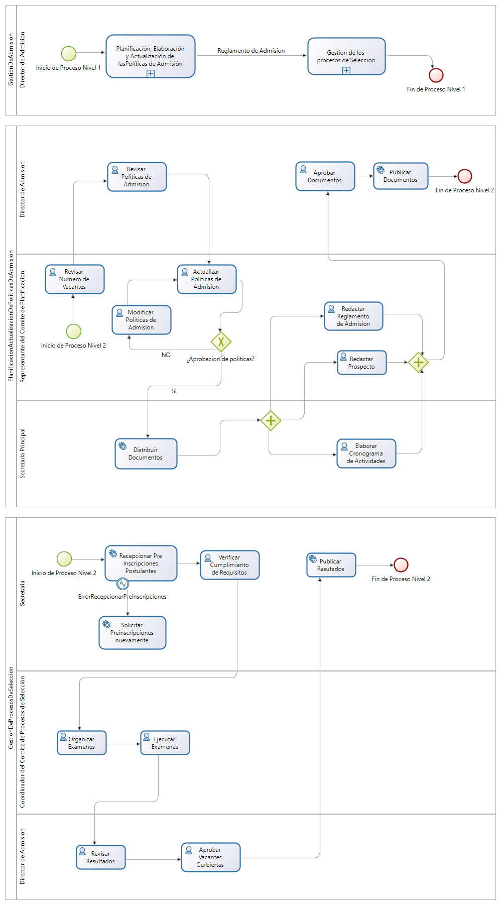
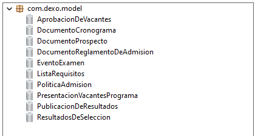
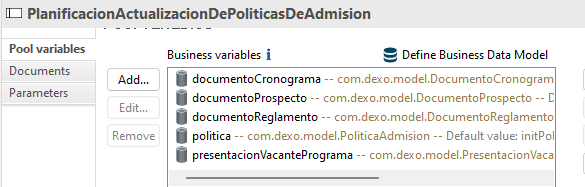
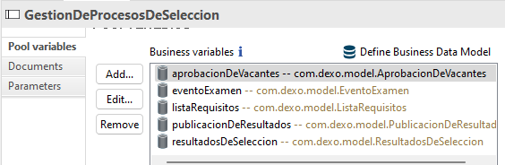
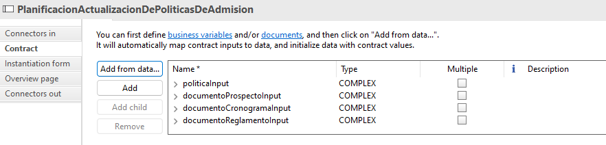
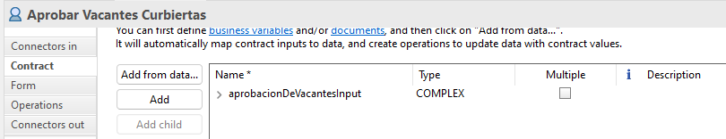
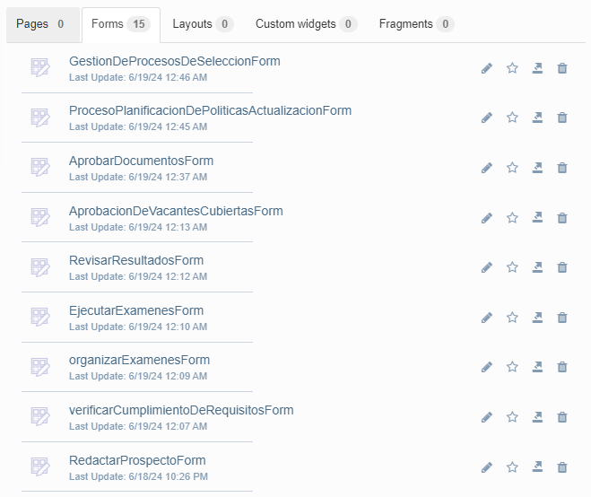
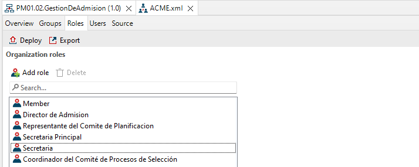

# 3.1 PROCESO DE GESTIÓN DE ADMISIÓN

## Modelo

  

### Descripción

#### Pool 1: Planificación y Actualización de Políticas de Admisión

| **Descripción** | El flujo dentro de este pool comienza con la recepción de los objetivos estratégicos y el número de vacantes disponibles, lo cual inicia el proceso de revisión de estos elementos críticos. Posteriormente, se lleva a cabo la revisión del número de vacantes. Tras la revisión, el siguiente paso es actualizar las políticas de admisión para alinearlas con los objetivos estratégicos y el número de vacantes. Luego, se procede a redactar el reglamento de admisión, el prospecto y el cronograma de actividades, asegurando que todos los documentos necesarios estén preparados. Estos documentos son sometidos a aprobación y, una vez aprobados, se publican oficialmente. Este flujo garantiza que las políticas de admisión se actualicen y se documenten de manera precisa y oportuna. |
|-----------------|----------------------------------------------------------------------------------------------------------------------------------------------------------------------------------------------------------------------------------------------------------------------------------------------------------------------------------------------------------------------------------------------------------------------------------------------------------------------------------------------------------------------------------------------------------------------------------------------------------------------------------------------------------------------------------------------------------------------------------------------------------------------------------------------------------------------------------------------------------------------------------------------------------------------------------------------------------------------------------------------------|
| **Entradas**    | - Objetivos Estratégicos - Número de Vacantes                                                                                                                                                                                                                                                                                                                                                                                                                                                                                                                                                                                                                                                                                                                                                                                          |
| **Salidas**     | - Políticas de Admisión - Reglamento de Admisión - Prospecto - Cronograma                                                                                                                                                                                                                                                                                                                                                                                                                                                                                                                                                                                                                                                                                                                                                                  |
| **Tareas**      | - **Revisar Objetivos Estratégicos**: Revisión de los objetivos estratégicos de la universidad para alinearlos con el proceso de admisión. - **Revisar Número de Vacantes**: Verificación del número de vacantes disponibles para el proceso de admisión. - **Actualizar Políticas de Admisión**: Modificación o creación de nuevas políticas de admisión según los objetivos y vacantes. - **Redactar Reglamento de Admisión**: Creación del reglamento que regirá el proceso de admisión. - **Redactar Prospecto**: Preparación del prospecto informativo para los postulantes. - **Elaborar Cronograma de Actividades**: Definición del cronograma de todas las actividades del proceso de admisión. - **Aprobar Documentos**: Aprobación formal de los documentos preparados. - **Publicar Documentos**: Publicación y distribución de los documentos aprobados. |

#### Pool 2: Gestión de Procesos de Selección

| **Descripción** | El flujo dentro de este pool comienza con la recepción del reglamento de admisión, el cronograma de actividades y los requisitos necesarios para participar en el proceso de selección. Se inicia con la recepción y verificación de las aplicaciones de los postulantes para asegurarse de que cumplan con los requisitos establecidos. Una vez verificadas las aplicaciones, se organiza y ejecuta la logística para la realización de los exámenes de admisión. Después de la ejecución de los exámenes, los resultados son evaluados detalladamente por el comité de evaluación, seguido de una revisión exhaustiva para garantizar la precisión. Finalmente, se publican los resultados y se confirma que las vacantes han sido cubiertas conforme a los procesos establecidos. Este flujo asegura un proceso de selección justo y transparente, culminando con la admisión de los postulantes más calificados. |
|-----------------|------------------------------------------------------------------------------------------------------------------------------------------------------------------------------------------------------------------------------------------------------------------------------------------------------------------------------------------------------------------------------------------------------------------------------------------------------------------------------------------------------------------------------------------------------------------------------------------------------------------------------------------------------------------------------------------------------------------------------------------------------------------------------------------------------------------------------------------------------------------------------------------------------------------------------------------------------------------------------------------------------------------------------------------------------------------|
| **Entradas**    | - Reglamento de Admisión - Cronograma de Actividades - Requisitos para optar a un proceso de selección                                                                                                                                                                                                                                                                                                                                                                                                                                                                                                                                                                                                                                                                                                                                      |
| **Salidas**     | - Número de Vacantes Cubiertas                                                                                                                                                                                                                                                                                                                                                                                                                                                                                                                                                                                                                                                                                                                                                                                                                 |
| **Tareas**      | - **Recepcionar Pre Inscripciones Postulantes**: Recepción y registro de las aplicaciones de los postulantes. - **Verificar Cumplimiento de Requisitos**: Verificación de que los postulantes cumplan con los requisitos establecidos. - **Organizar Exámenes**: Preparación logística y administrativa para la realización de los exámenes de admisión. - **Ejecutar Exámenes**: Realización efectiva de los exámenes. - **Evaluar Resultados de Exámenes**: Evaluación de los resultados obtenidos en los exámenes. - **Revisión de Resultados**: Revisión y validación de los resultados por parte del comité de evaluación. - **Publicar Resultados**: Publicación de los resultados de los exámenes. - **Aprobar Vacantes Cubiertas**: Confirmación y registro de las vacantes cubiertas tras el proceso de selección. |

### Sectores/departamentos/áreas-funcionales/papeles/roles involucrados en los procesos

| **Rol/Departamento**        |
|-----------------------------|
| - Dirección de Admisión     |
| - Consejo Universitario     |

### Elementos de información necesarios (dato o información) en el proceso

| **Elementos de Información**                                                |
|------------------------------------------------------------------------------|
| - Objetivos Estratégicos correspondientes a Plan Estratégico Institucional (PEI) |
| - Número de vacantes                                                        |
| - Reglamento de admisión                                                     |
| - Cronograma de actividades                                                  |
| - Requisitos para optar a un proceso de selección                            |

### Modelo de Datos

  

### Variables

  

  

### Contratos

  

  

### Formularios GUI

  

  

### Mapeamiento de Actores y Roles

  

