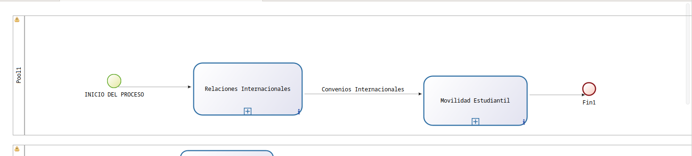
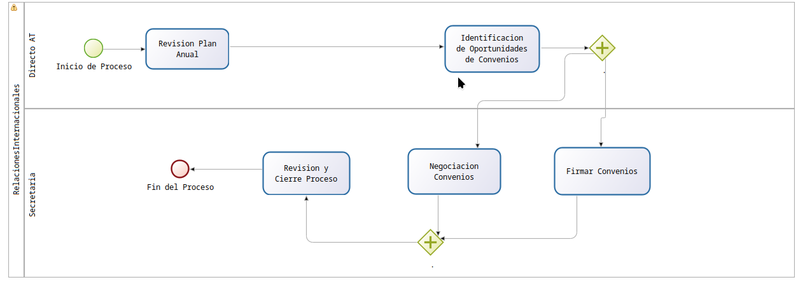
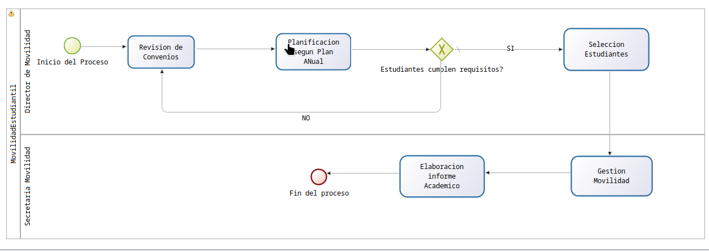
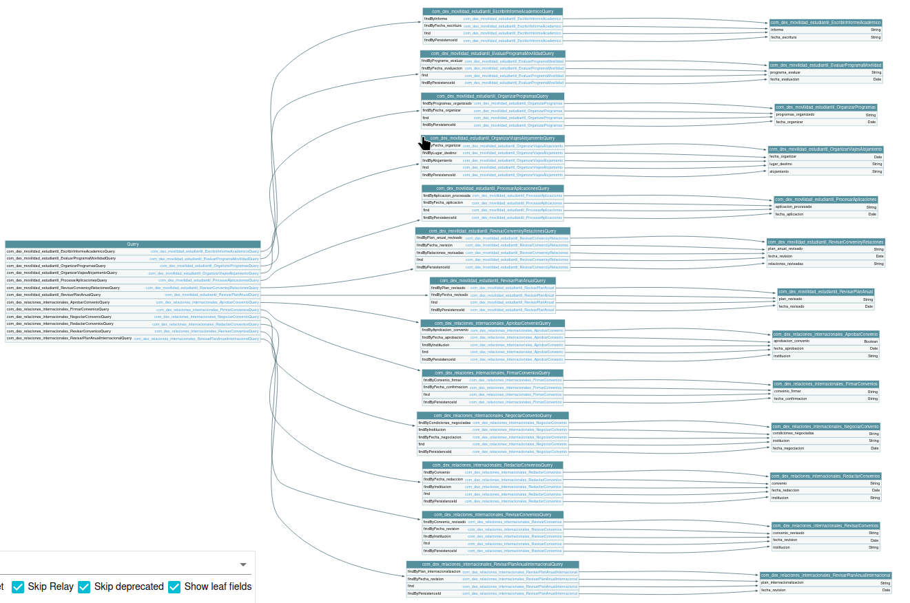
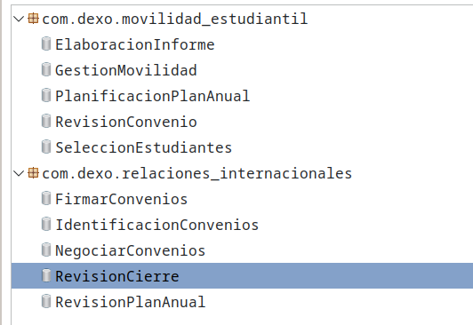
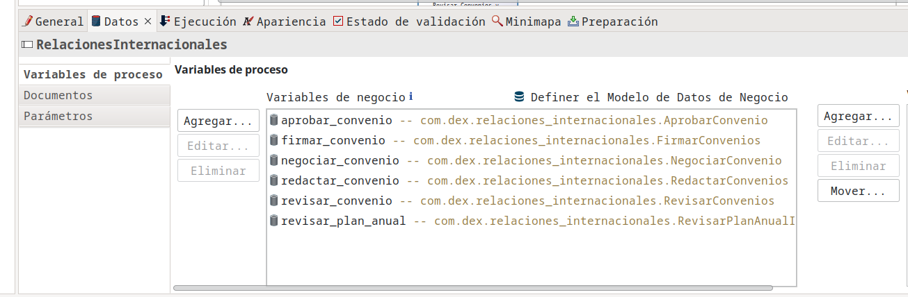
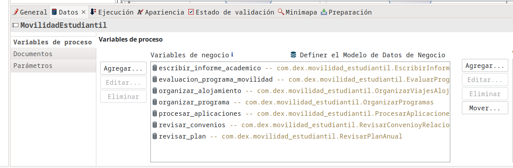
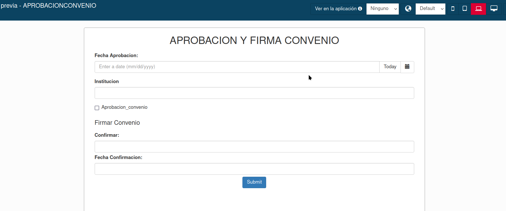

# 3.6 PROCESO DE INTERNACIONALIZACIÓN INDIVIDUAL (Huaman, Luciana)

## Modelo

  

  

  

### Descripción

#### Pool 1: Relación Internacionales

| **Descripción** | Este proceso se enfoca en gestionar las relaciones internacionales mediante la revisión del plan anual de internacionalización y la negociación de convenios. Comienza con la revisión del plan anual, seguida por la negociación y redacción de convenios, y culmina con la revisión, aprobación, firma y publicación de los convenios. |
|-----------------|---------------------------------------------------------------------------------------------------------------------------------------------------------------------------------------------------------------------------------------------------------------------------------------------------------------------------------------------------------------------------------------------------------------------------------------------------------------------------------------------------------------------------------------------------------------------------------------------------------------------------------------------------------------------------------------------------------------------------------------------------------------------------------------------------------------------------------|
| **Entradas**    | - Plan Anual de Internacionalización                                                                                                                                                                                                                                                                                                                                                                                                                                                                                                                                                                                                                                                                                                                                                                                                                                                                                                                                                                                                                              |
| **Salidas**     | - Convenios y relaciones internacionales                                                                                                                                                                                                                                                                                                                                                                                                                                                                                                                                                                                                                                                                                                                                                                                                                                                                                                                                                                                                                              |
| **Tareas**      | - **Revisar Plan Anual de Internacionalización**: La Oficina de Relaciones Internacionales revisa el plan anual de internacionalización. - **Negociar Convenios**: La Oficina de Relaciones Internacionales negocia los convenios con instituciones extranjeras. - **Redactar Convenios**: La Oficina de Relaciones Internacionales redacta los convenios negociados. - **Revisar Convenios**: La Oficina de Relaciones Internacionales revisa los convenios redactados. - **Aprobar Convenios**: La Dirección de Internacionalización aprueba los convenios revisados. - **Firmar Convenios**: La Dirección de Internacionalización firma los convenios aprobados. - **Publicar Convenios**: La Secretaría General publica los convenios firmados. |

#### Pool 2: Movilidad Estudiantil

| **Descripción** | Este proceso se enfoca en la ejecución de programas de movilidad estudiantil, utilizando los convenios y el plan anual de internacionalización. Comienza con la revisión de los convenios y el plan anual, seguida por la organización de los programas de movilidad, el procesamiento de aplicaciones, y la organización de viajes y alojamiento. Culmina con la evaluación del programa de movilidad, la redacción de informes académicos, y la publicación de resultados. |
|-----------------|---------------------------------------------------------------------------------------------------------------------------------------------------------------------------------------------------------------------------------------------------------------------------------------------------------------------------------------------------------------------------------------------------------------------------------------------------------------------------------------------------------------------------------------------------------------------------------------------------------------------------------------------------------------------------------------------------------------------------------------------------------------------------------------------------------------------------------|
| **Entradas**    | - Convenios y Relaciones Internacionales - Plan Anual de Internacionalización                                                                                                                                                                                                                                                                                                                                                                                                                                                                                                                                                                                                                                                                                                                                                                                                                                                                                                                                                                                               |
| **Salidas**     | - Movilidad Estudiantil Ejecutada - Informe Académico Estudiantil                                                                                                                                                                                                                                                                                                                                                                                                                                                                                                                                                                                                                                                                                                                                                                                                                                                                                                                                                                                                             |
| **Tareas**      | - **Revisar Convenios y Relaciones Internacionales**: La Oficina de Movilidad Estudiantil revisa los convenios existentes. - **Revisar Plan Anual de Internacionalización**: La Oficina de Movilidad Estudiantil revisa el plan anual de internacionalización. - **Organizar Programas de Movilidad**: La Oficina de Movilidad Estudiantil organiza los programas de movilidad. - **Procesar Aplicaciones**: La Oficina de Movilidad Estudiantil procesa las aplicaciones de los estudiantes. - **Organizar Viajes y Alojamiento**: La Oficina de Movilidad Estudiantil organiza los viajes y el alojamiento para los estudiantes participantes. - **Evaluar Programa de Movilidad**: La Oficina de Movilidad Estudiantil evalúa la efectividad del programa de movilidad. - **Redactar Informe Académico Estudiantil**: La Oficina de Movilidad Estudiantil redacta el informe académico sobre el programa de movilidad. - **Publicar Resultados de Movilidad**: La Secretaría General publica los resultados de movilidad. |

### Sectores/departamentos/áreas-funcionales/papeles/roles involucrados en el proceso de negocio

| **Rol/Departamento**                |
|------------------------------------|
| - Oficina de Relaciones Internacionales |
| - Dirección de Internacionalización |
| - Secretaría General               |

### Elementos de información necesarios (dato o información) en el proceso de negocio

| **Elementos de Información** |
|------------------------------|
| - Plan Anual de Internacionalización |

### Modelo de Datos

  

  

### Variables

  

  

### Contratos

### Formularios GUI

  

