# 3.7 PROCESO DE GESTIÓN DE RIESGOS Y DESASTRES 

## Modelo

  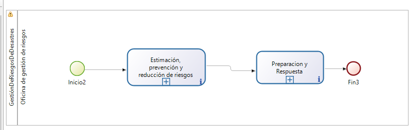

  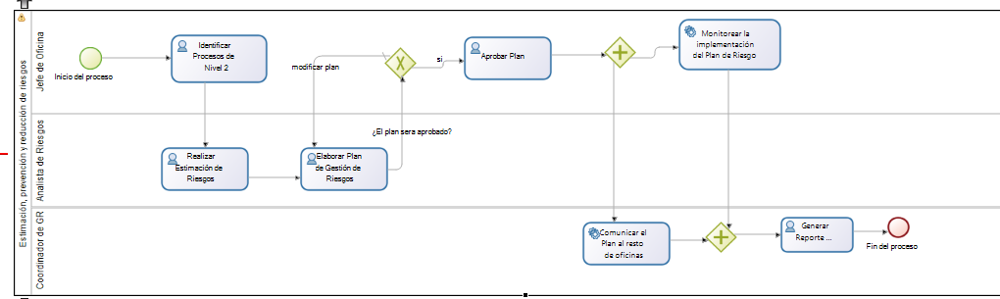

  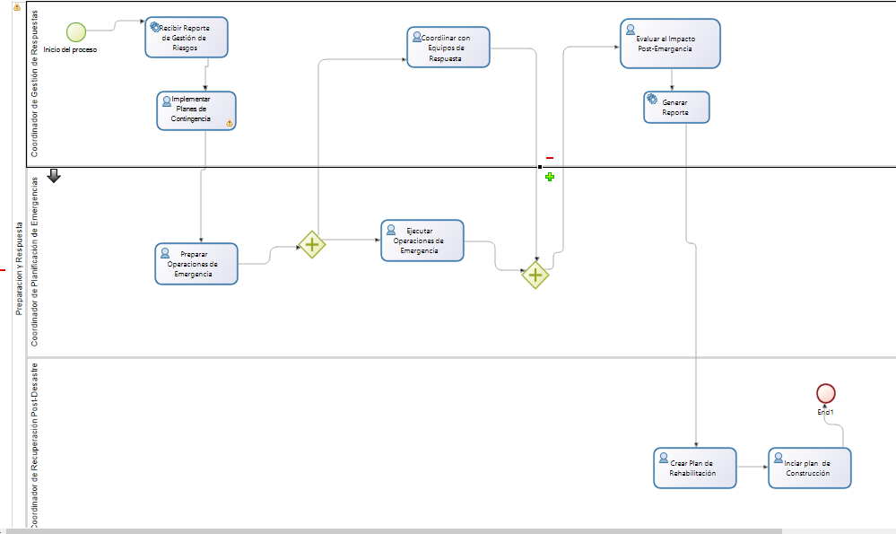

### Descripción

#### Pool 1: Estimación, prevención y reducción de riesgos

| **Descripción** | Este pool se encarga de gestionar la identificación y reducción de riesgos en la universidad. Comienza con la identificación de procesos nivel 2 y la revisión de normatividades y lineamientos vigentes. Luego, se evalúan los riesgos y se elabora un plan de gestión de riesgos. Se toman decisiones basadas en la adecuación del plan, implementando medidas de reducción de riesgos si el plan es adecuado o revisándolo en caso contrario. Las medidas incluyen monitoreo, capacitación y comunicación del plan. Finalmente, el proceso concluye con la implementación de estas medidas. |
|-----------------|--------------------------------------------------------------------------------------------------------------------------------------------------------------------------------------------------------------------------------------------------------------------------------------------------------------------------------------------------------------------------------------------------------------------------------------------------------------------------------------------------------------------------------------------------------------------------------------------------------------------------------------------------------------------------------------------------------------------------------------------------------------------------------------|
| **Entradas**    | - Normatividad, Lineamientos - Plan Nacional de Gestión de Riesgos                                                                                                                                                                                                                                                                                                                                                                                                                                                                                                                                                                                                                                                                                     |
| **Salidas**     | - Listado de procesos identificados - Evaluación normativa actualizada - Informe de evaluación de riesgos - Plan de gestión de riesgos - Decisión sobre la adecuación del plan - Medidas implementadas - Plan revisado                                                                                                                                                                                                                                                                                                                                                                                                                                                                                 |
| **Tareas**      | - **Identificar Procesos Nivel 2**: Identificar procesos específicos susceptibles a riesgos. - **Realizar Estimación de Riesgos**: Evaluar amenazas y vulnerabilidades potenciales. - **Elaborar Plan de Gestión de Riesgos**: Crear un plan detallado para abordar riesgos identificados. - **Evaluar Plan**: Revisar la eficacia y adecuación del plan de gestión de riesgos. - **Aprobar Plan**: Decidir si se aprueba el plan. - **Monitoreo de Riesgos**: Supervisar riesgos continuamente para una respuesta proactiva. - **Comunicación del Plan**: Comunicar claramente el plan de gestión de riesgos a todas las partes interesadas. - **Revisión y Modificación del Plan**: Actualizar el plan de acuerdo con cambios y lecciones aprendidas. - **Generar Reporte de Riesgo**: A partir de los modelos, generar un reporte final. |

#### Pool 2: Preparación y Respuesta

| **Descripción** | Este pool está diseñado para manejar la preparación y respuesta a desastres. Comienza con el desarrollo y la implementación de planes de contingencia, seguido de la preparación de operaciones de emergencia. Las tareas paralelas incluyen la ejecución de operaciones de emergencia y la coordinación con equipos de respuesta. Tras estas acciones, se evalúa el impacto post-emergencia y se planifican las actividades de rehabilitación y reconstrucción. Este proceso garantiza una respuesta eficiente y la recuperación tras un desastre. |
|-----------------|----------------------------------------------------------------------------------------------------------------------------------------------------------------------------------------------------------------------------------------------------------------------------------------------------------------------------------------------------------------------------------------------------------------------------------------------------------------------------------------------------------------------------------------------------------------------------------------------------------------------------------------------------------------------------------------------------------------------------------------------------------------------|
| **Entradas**    | - Plan de gestión de riesgos del Pool 1 - Planes implementados - Preparación completada - Operaciones de emergencia ejecutadas - Informe de evaluación de impacto                                                                                                                                                                                                                                                                                                                                                                                                                                                                                                                                                                                |
| **Salidas**     | - Planes de contingencia desarrollados - Planes implementados - Preparación completada - Operaciones de emergencia ejecutadas - Informe de evaluación de impacto - Plan de rehabilitación y reconstrucción                                                                                                                                                                                                                                                                                                                                                                                                                                                                                                                                                                            |
| **Tareas**      | - **Desarrollo de Planes de Contingencia**: Crear estrategias detalladas para abordar situaciones de emergencia. - **Implementación de Planes de Contingencia**: Poner en práctica los planes diseñados para hacer frente a emergencias. - **Preparación de Operaciones de Emergencia**: Organizar recursos y procedimientos para estar listos ante situaciones críticas. - **Ejecución de Operaciones de Emergencia**: Realizar acciones definidas en los planes de contingencia durante emergencias. - **Coordinación con Equipos de Respuesta**: Colaborar con equipos especializados para una respuesta efectiva ante emergencias. - **Evaluación de Impacto Post-Emergencia**: Analizar las consecuencias y efectos de las emergencias ocurridas. - **Planificación de Rehabilitación y Reconstrucción**: Elaborar estrategias y cronogramas para restaurar las operaciones y reconstruir lo afectado por la emergencia. |

### Sectores/departamentos/áreas-funcionales/papeles/roles involucrados en el proceso de negocio

| **Rol/Departamento**                                 |
|-----------------------------------------------------|
| - Oficina de Gestión de Riesgos de Desastres y Adaptación al Cambio Climático |

### Elementos de información necesarios (dato o información) en el proceso de negocio

| **Elementos de Información** |
|------------------------------|
| - Normatividad y Lineamientos |
| - Informes de evaluación y análisis de vulnerabilidades que identifican posibles riesgos. |
| - Documentos de planificación y estrategias de mitigación para abordar los riesgos identificados. |
| - Evaluaciones y feedback sobre la efectividad del plan de gestión de riesgos. |
| - Documentación detallada de los planes de respuesta para abordar posibles emergencias. |
| - Procedimientos y recursos necesarios para llevar a cabo las operaciones de emergencia. |
| - Informe de Evaluación de Impacto Post-Emergencia. |
| - Estrategias y cronogramas de recuperación para restaurar la normalidad después de la emergencia. |

### Modelo de Datos

  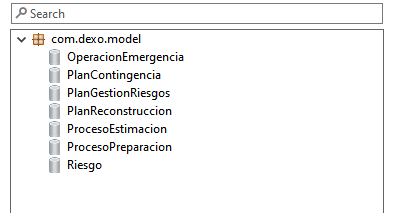

  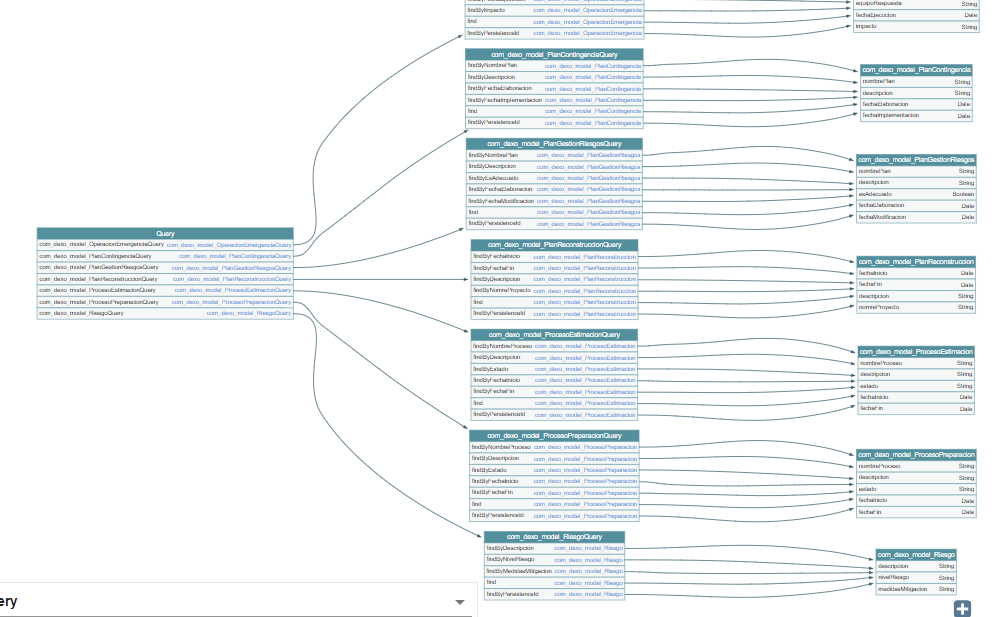

### Variables

  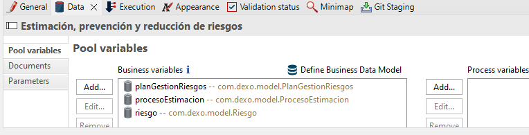

  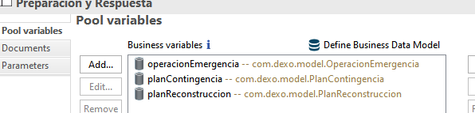

### Contratos

  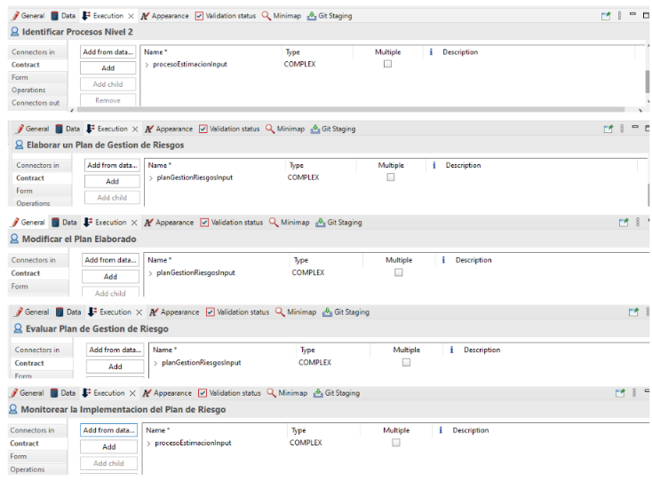

### Formularios GUI

  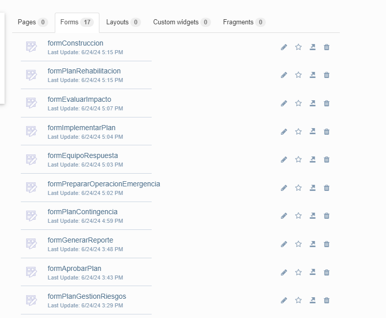

  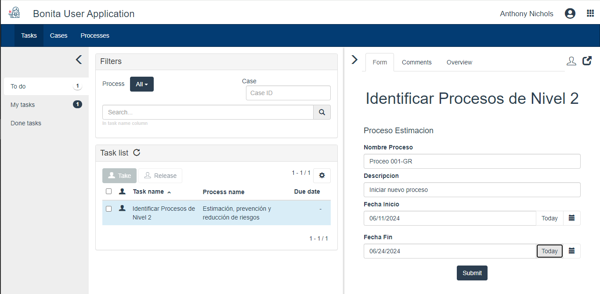

  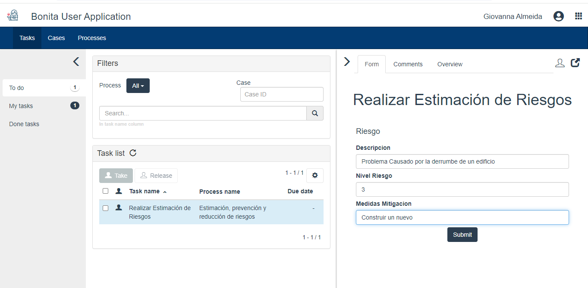

  

  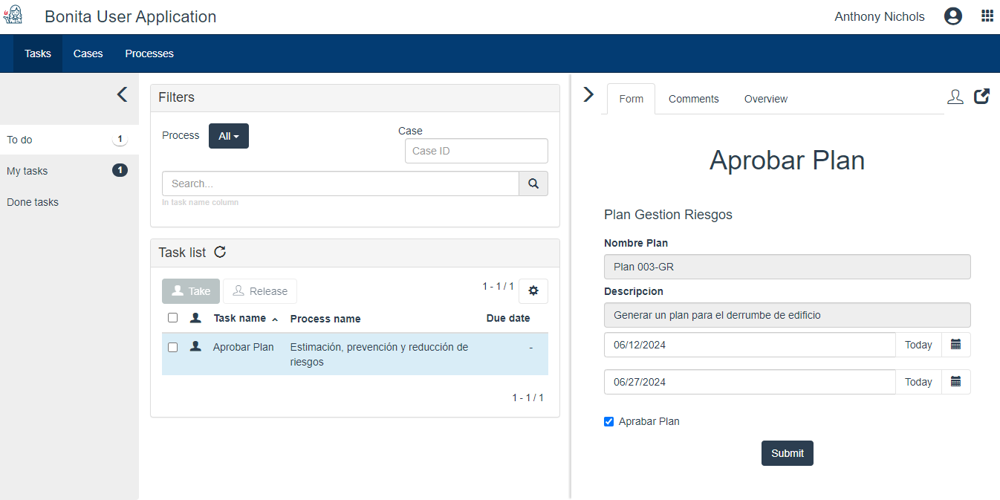

  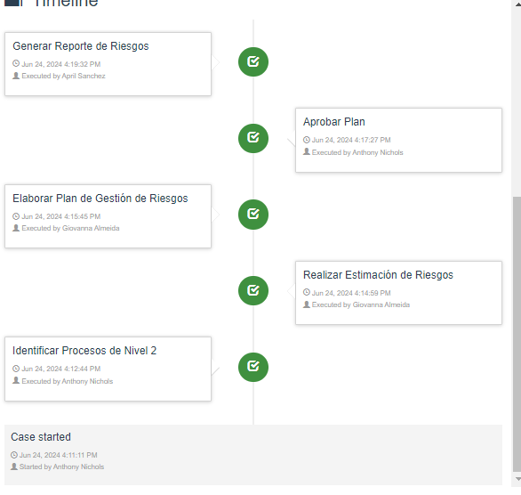

  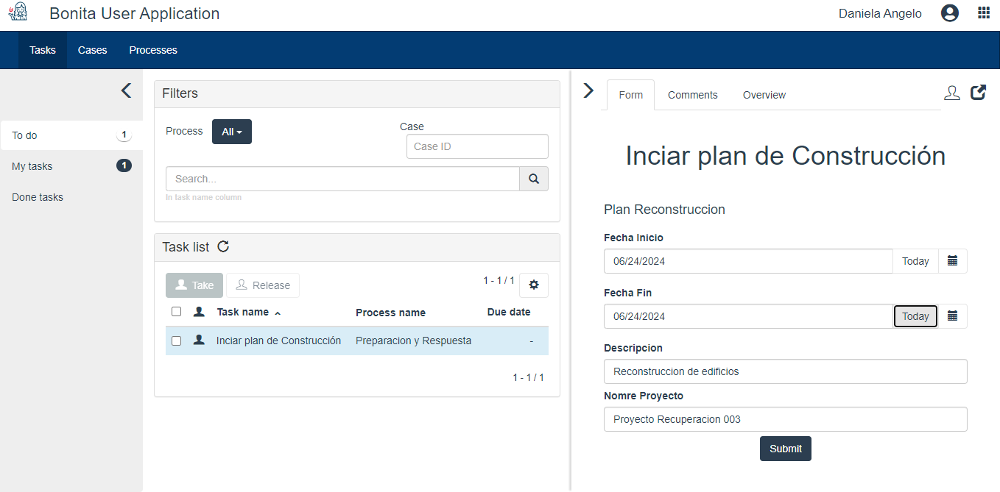

  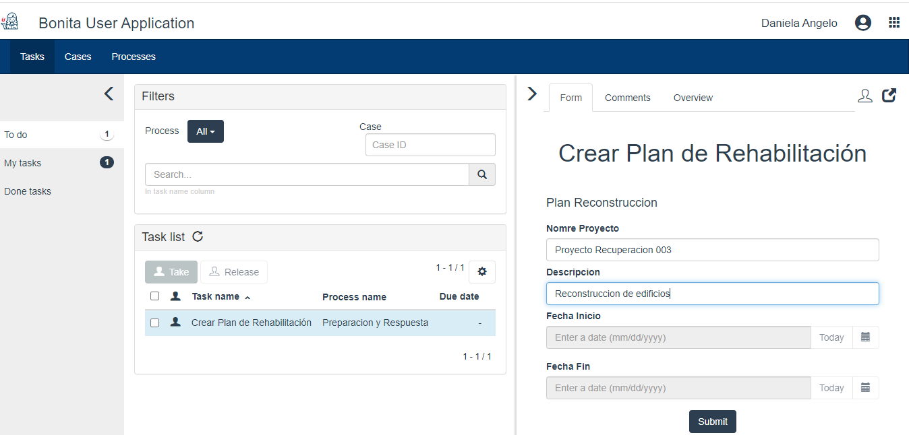

  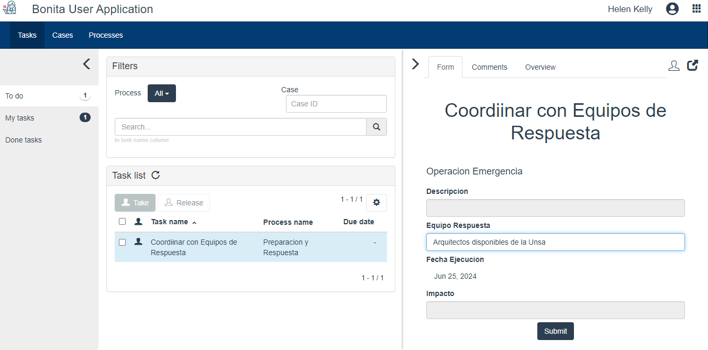

  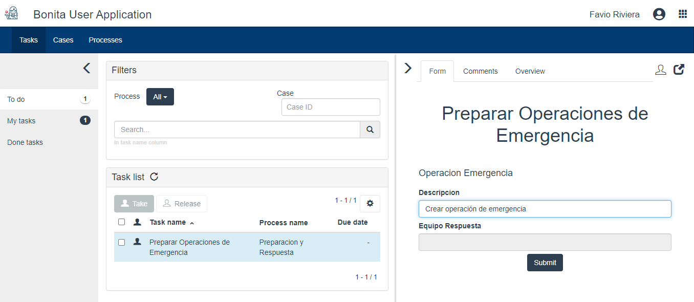

  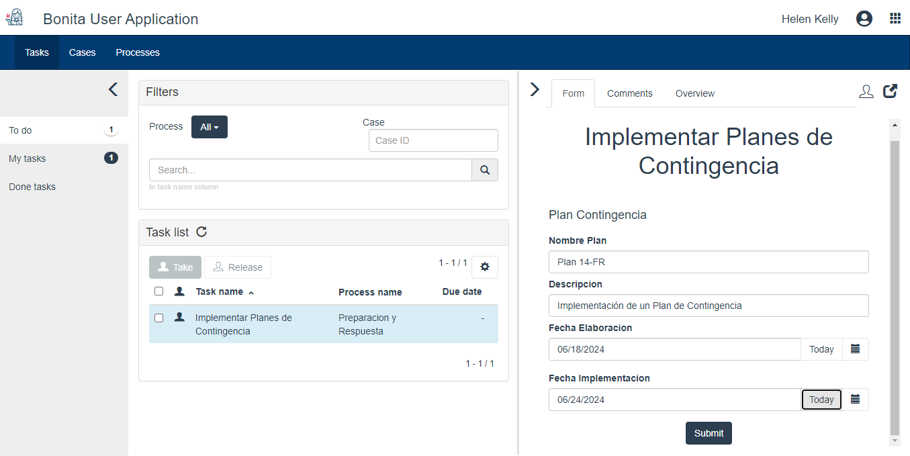

  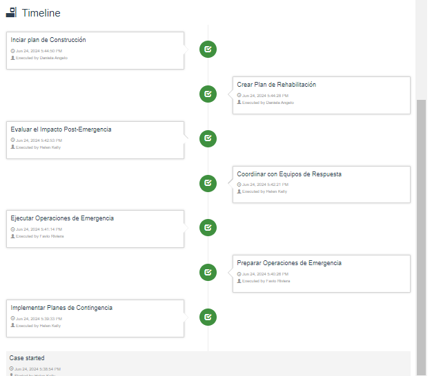

### Mapeamiento de Actores y Roles

  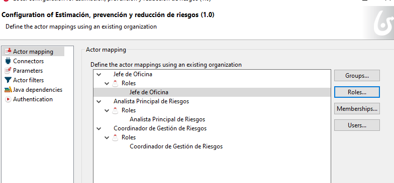

