# 3.4 PROCESO DE GESTIÓN INSTITUCIONAL 

## Modelo:

  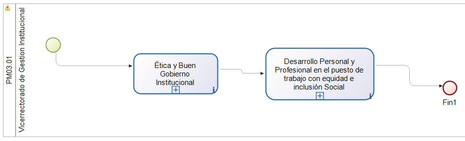

  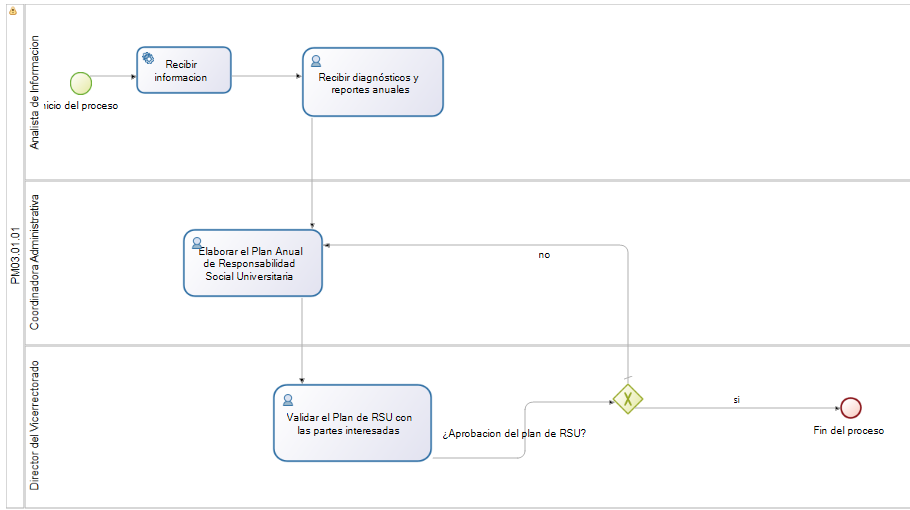

  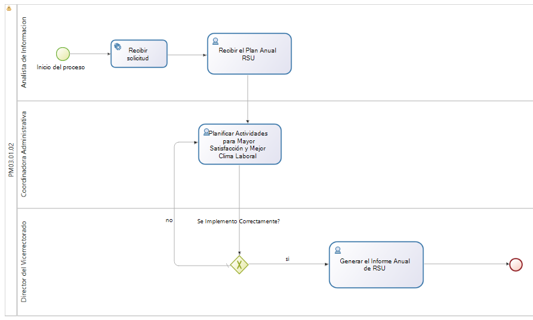

### Descripción:

#### Pool 1: Gestión Institucional

| **Descripción** | El flujo dentro de este pool comienza con la gestión institucional, que conduce a la elaboración del Plan Anual de Responsabilidad Social Universitaria (RSU) a través del subproceso de Ética y Buen Gobierno Institucional. Una vez generado, el Plan Anual de RSU es utilizado en el subproceso de Desarrollo Personal y Profesional en el Puesto de Trabajo con Equidad e Inclusión Social para llevar a cabo actividades que mejoren el clima laboral y la satisfacción del personal. Estas actividades concluyen con la generación de informes y evaluación de resultados. |
|-----------------|--------------------------------------------------------------------------------------------------------------------------------------------------------------------------------------------------------------------------------------------------------------------------------------------------------------------------------------------------------------------------------------------------------------------------------------------------------------------------------------------------------------------------------------------------------------------------------------------------------------------------------------------------------------------------------------------------------------------------------------------------------------------------------------------------------------------------------------------------------------------------------------------------------|
| **Entradas**    | - Diagnóstico Anual de Gestión de la RSU - Reporte de Sostenibilidad Anual (informe Anual RSU) - Plan Estratégico Institucional (PEI)                                                                                                                                                                                                                                                                                                                                                                                                                                                                                                                                                                                                                                            |
| **Salidas**     | - Actividades - mayor satisfacción, clima laboral, gestión ecoeficiente y ambiente responsable                                                                                                                                                                                                                                                                                                                                                                                                                                                                                                                                                                                                                                                                                                                                           |
| **Tareas**      | - **Gestión Institucional**: Inicia el proceso global de gestión institucional. - **Ética y Buen Gobierno Institucional**: Desarrollo del Plan Anual de RSU que incluye la revisión de diagnósticos y reportes, validación, y generación del plan final. - **Desarrollo Personal y Profesional en el Puesto de Trabajo con Equidad e Inclusión Social**: Implementación de actividades planificadas para mejorar el clima laboral y la satisfacción, seguimiento, y generación del informe anual. |

#### Pool 2: Ética y Buen Gobierno Institucional

| **Descripción** | El flujo dentro de este pool comienza con la recepción de entradas, como el Diagnóstico Anual de Gestión de la RSU, el Reporte de Sostenibilidad Anual y el PEI, lo que inicia el proceso de análisis de estos documentos. Si los diagnósticos y reportes anuales no son aprobados, se solicita su corrección. Una vez aprobados, se elabora el Plan Anual de RSU, que es luego validado con las partes interesadas. Si el plan no es validado, se reciben todos los comentarios a considerar y se ajusta el plan en consecuencia. Finalmente, se genera el Plan Anual de RSU aprobado y validado. |
|-----------------|-------------------------------------------------------------------------------------------------------------------------------------------------------------------------------------------------------------------------------------------------------------------------------------------------------------------------------------------------------------------------------------------------------------------------------------------------------------------------------------------------------------------------------------------------------------------------------------------------------------------------------------------------------------------------------------------------------------------------------------------------------------------------------------------------------------------------------------------------------------------------------------------------------------------------------------|
| **Entradas**    | - Diagnóstico Anual de Gestión de la RSU - Reporte de Sostenibilidad Anual (informe Anual RSU) - Plan Estratégico Institucional (PEI)                                                                                                                                                                                                                                                                                                                                                                                                                                                                                                                                                                                                                                            |
| **Salidas**     | - Plan Anual RSU                                                                                                                                                                                                                                                                                                                                                                                                                                                                                                                                                                                                                                                                                                                                                                                                                                                                                  |
| **Tareas**      | - **Recibir diagnósticos y reportes anuales**: Análisis de los diagnósticos y reportes anuales recibidos para evaluar su contenido y relevancia. (Actor: Asistente) - **Elaborar el Plan Anual de Responsabilidad Social Universitaria**: Creación de un borrador del Plan Anual de RSU basado en los diagnósticos y reportes aprobados. (Actor: Secretaría) - **Validar el Plan de RSU con las partes interesadas**: Validación del borrador del Plan Anual de RSU con las partes interesadas para asegurar su conformidad. (Actor: Jefe) |

#### Pool 3: Desarrollo Personal y Profesional en el Puesto de Trabajo con Equidad e Inclusión Social

| **Descripción** | El flujo dentro de este pool comienza con la recepción del Plan Anual de RSU, lo cual da inicio a la planificación de actividades que propicien una mayor satisfacción y mejor clima laboral. Una vez planificadas, estas actividades se implementan. Posteriormente, se realiza el monitoreo y evaluación de las actividades implementadas. Si se determina que las actividades se implementan correctamente, se procede a la generación del Informe Anual de RSU. Si no se implementan correctamente, se ajustan y re-evalúan las actividades. |
|-----------------|---------------------------------------------------------------------------------------------------------------------------------------------------------------------------------------------------------------------------------------------------------------------------------------------------------------------------------------------------------------------------------------------------------------------------------------------------------------------------------------------------------------------------------------------------------------------------------------------------------------------------------------------------------------------------------------------------------------------------------------------------------------------------------------------------------------------------------------------------------------------------------------------------|
| **Entradas**    | - Plan Anual RSU                                                                                                                                                                                                                                                                                                                                                                                                                                                                                                                                                                                                                                                                                                                                                                                                                                                                                  |
| **Salidas**     | - Plan Anual RSU                                                                                                                                                                                                                                                                                                                                                                                                                                                                                                                                                                                                                                                                                                                                                                                                                                                                                  |
| **Tareas**      | - **Recibir el Plan Anual RSU**: Recepción y revisión del Plan Anual de Responsabilidad Social Universitaria. (Actor: Asistente) - **Planificar Actividades para Mayor Satisfacción y Mejor Clima Laboral**: Planificación de actividades destinadas a mejorar la satisfacción y el clima laboral dentro de la universidad. (Actor: Secretaría) - **Evaluar Actividades**: Supervisión y evaluación de las actividades implementadas para asegurar su efectividad. (Actor: Jefe) - **Generar el Informe Anual de RSU**: Creación del informe anual basado en las actividades implementadas y su impacto en la satisfacción y el clima laboral. (Actor: Secretaría) |

### Sectores/departamentos/áreas-funcionales/papeles/roles involucrados en el proceso de negocio

| **Rol/Departamento**                                    |
|--------------------------------------------------------|
| - Escuelas Profesionales (Facultad)                   |
| - Comité de Responsabilidad Interna (Facultad)        |
| - Unidades de Responsabilidad Social y Extensión Universitaria (Facultad) |

### Elementos de información necesarios (dato o información) en el proceso de negocio

| **Elementos de Información**                       |
|-----------------------------------------------------|
| - Diagnóstico Anual de Gestión de la RSU           |
| - Reporte de Sostenibilidad Anual (informe Anual RSU) |
| - Plan Estratégico Institucional (PEI)              |

### Roles

  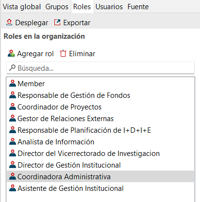

### Modelos

  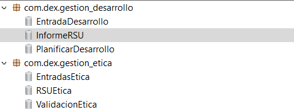

  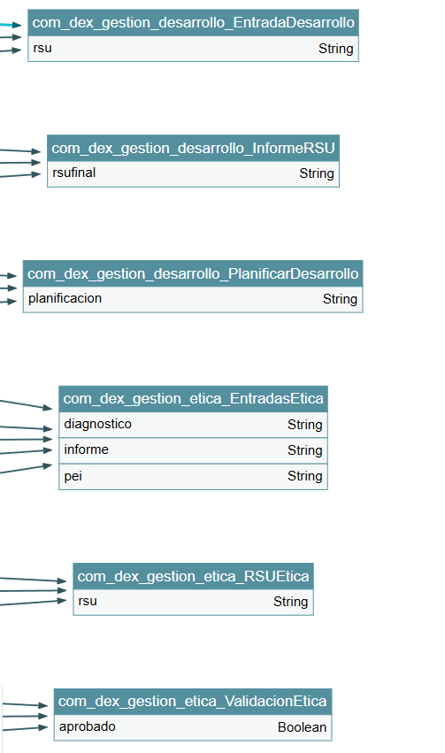

### Formularios

### PM03.01.01:

  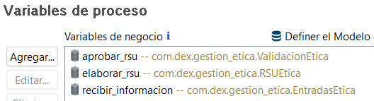

  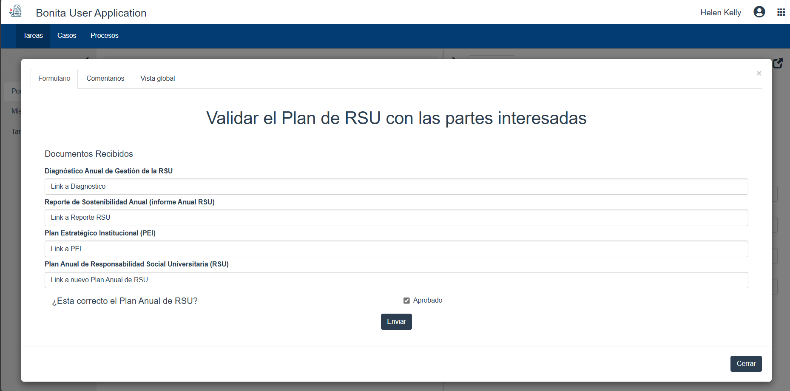

### PM03.01.02:

  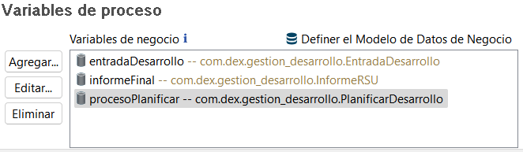

  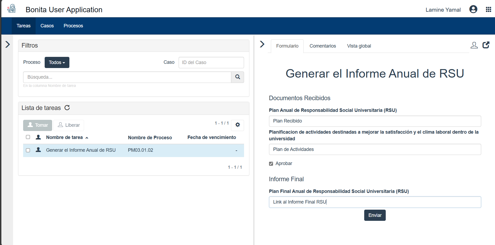

### Total de Formularios

### PM03.01.01:

  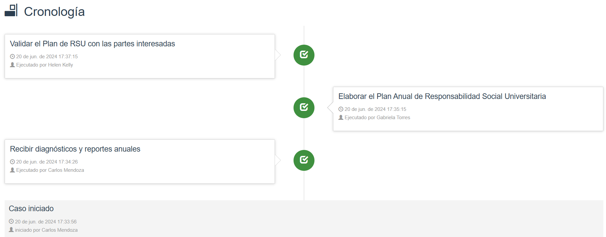

### PM03.01.02:

  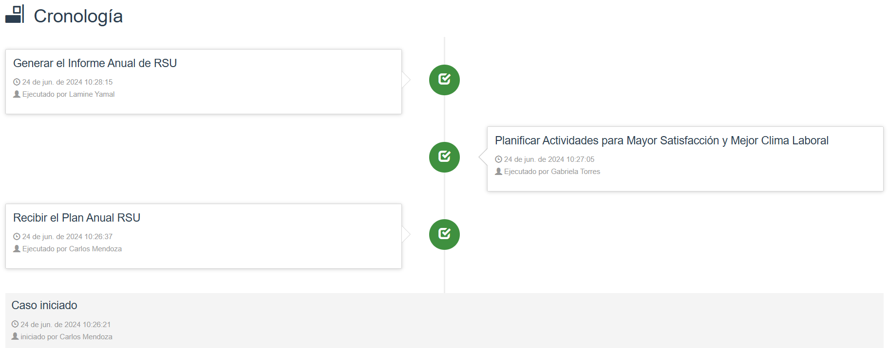

